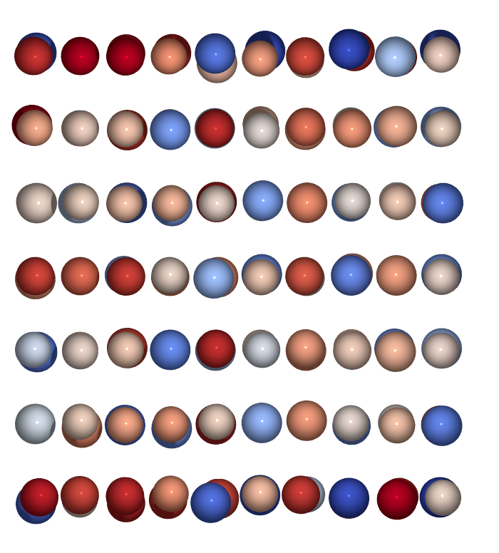

# Atomsplot

Atomsplot is a small Python command-line program to render images of atomic structures using [ASE](https://wiki.fysik.dtu.dk/ase/index.html) and [POV-Ray](http://www.povray.org/).

It was developed as a spin-off of the image generation module in the [xsorb](https://github.com/Enry99/xsorb) code to automate the study of molecular adsorption (E. Pedretti, P. Restuccia, M.C. Righi, Comput. Phys. Commun. 291 (2023), 108827)

## Installation
First, install the program with
```sh
pip install atomsplot
```

or directly from source with
```sh
git clone https://github.com/Enry99/atomsplot
cd atomsplot
pip install .
```

## Dependencies

- [povray](https://www.povray.org/) to generate high-quality images
- [ffmpeg](https://ffmpeg.org/) to generate movies of trajectories

These can be easily installed on Linux systems with:

```sh
sudo apt install povray ffmpeg
```
if you have administrator privileges, or with conda (Conda/Miniconda/Mamba/Micromamba) with:
```sh
[conda] install povray ffmpeg
```
where `[conda]` can be replaced with `mamba`, `micromamba` or `miniconda` depending on your setup.

While povray is not strictly necessary (you can use the option -nopov in the CLI) and the images can be generated also with ASE internal renderer based on matplotlib, the image quality and most of the functionalities of this code are strongly limited, and can be useful mostly as a fast way to preview the structures.

Also ffmpeg is not mandatory: if it's not available, atomsplot will try to fallback on imagemagick convert to generate a gif of the animation instead of a video

## Usage

Basic usage for generating an image:
```sh
atomsplot filename.xyz
```

To generate the frames for a trajectory you can use:
```sh
atomsplot filename.xyz -i :
```

To generate also a movie with the frames you can use:
```sh
atomsplot filename.xyz -i ::10 -m
```

A list with all the options can be found with
```sh
atomsplot -h
```

### image_settings.json file
Additional parameters, such as color scheme and atomic radius can be specified in a image_settings.json file, which must be located in the working directory (see the example in the `examples` folder). This file is read by atomsplot and used to set the rendering parameters for the images.

The list of all the options is:
- `color_scheme`: can be 'vesta', 'jmol', 'cpk' (default: 'jmol')
- `atomic_colors`: a dictionary with specific overrides to the color scheme, in RGB format
- `molecule_colors`: a dictionary with specific colors for the atoms that are specified in `mol_indices`. These will override the colors in `atomic_colors` and the color scheme.
- `atomic_radius`: the radius of the atoms in the image (default: 0.7)
- `bond_radius`: the radius of the bonds in the image (default: 0.8)
- `bond_line_width`: the width of the bond lines in the image (default: 0.15)
- `cell_line_width`: the width of the cell lines in the image (default: 0.05)
- `mol_indices`: a list of indices of the atoms that should be considered part of the molecule (for coloring and other features).
- `nontransparent_atoms`: if specified, only the atoms with indices in this list will be rendered as non-transparent, while the others will be rendered as transparent (default: all atoms are non-transparent)


## Examples
Examples of usage can be found in the `examples` folder. Some functionalities are shown here:
---

Double(triple) bonds:


---

Depth cueing:

- top view of 2x1 dimer-reconstructed C(100) slab


- molecules on Si-doped DLC surface


---

Color coding with coordination number (here lateral view of amophous carbon slab. yellow = sp, green = sp2, violet = sp3):


---

Color coding + depth cueing (here top view of the same slab):


---

Magnetic moments:

- color coding of magnetic moments in a high-entropy alloy (blue to red gradient: down to up spin):



- arrows for magnetic moments in the same structure (arrow length proportional to the magnetic moment, atoms are colored with VESTA color scheme):


---

Charge density isosurfaces (+ transparent atoms):

<p float="left">
    
    
</p>